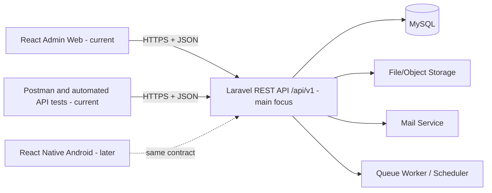
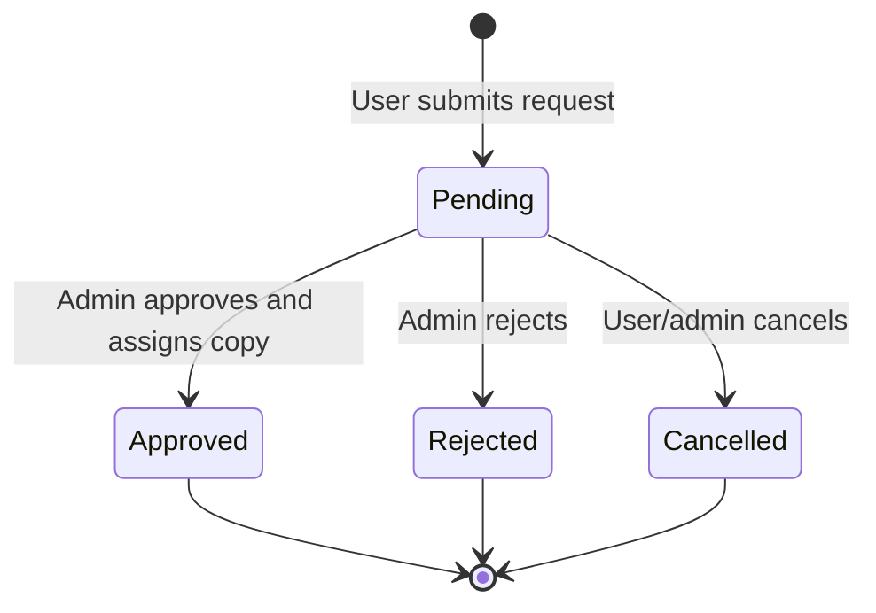
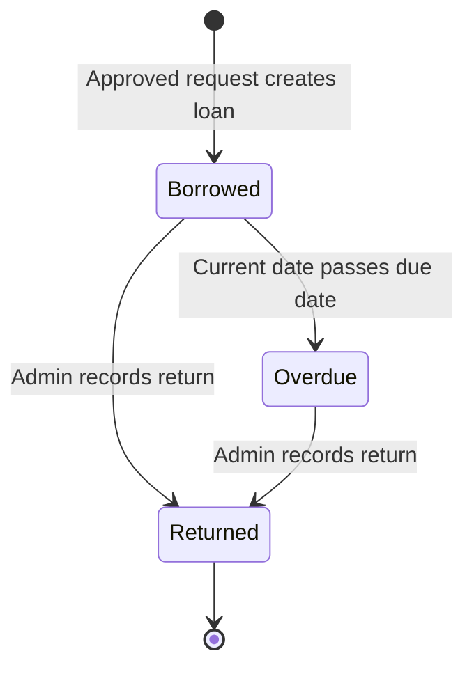
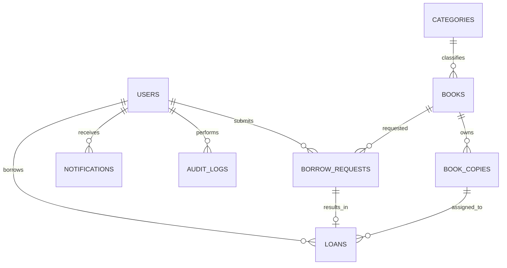

# Library Management System — Project Blueprint

> README-style implementation guide for an API-first, two-role Library Management System using a modular Laravel REST API, MySQL/MariaDB, a React admin web application, and a later React Native Android application.

## Document purpose

This document is the shared build plan for developers, designers, testers, and project reviewers. It defines the product scope, technical architecture, account rules, database, API, user interfaces, implementation order, quality requirements, deployment plan, and the boundary between the Minimum Viable Product (MVP) and later enhancements.

Use it as the starting `README.md` for the project. Update decisions here before changing the implementation so the API, web application, later mobile application, and database remain aligned.

### Current implementation focus

The immediate deliverable is the **Laravel API plus the React admin web application**. The API is the main assessed product and must be complete enough for both Admin and User use cases even before the member mobile client is implemented. User endpoints are demonstrated with automated tests and an API client such as Postman during the web-first milestone.

**Implementation progress (2026-08-21):** Original blueprint Phases 4 and 5 are now implemented for local/development acceptance, building on the existing authentication/RBAC, catalog/inventory, and User administration modules. The modular Laravel API covers request submission/review, transactional copy allocation and loan creation, returns, due-soon/overdue synchronization, owner-scoped notifications, dashboard aggregates, filtered reports, and CSV export. The React Admin application uses live APIs for every production screen and no longer imports prototype data. The current automated backend suite passes 41 tests with 244 assertions; the React TypeScript check and production build also pass. Staging UAT, password-recovery completion from the earlier account phase, CI, and deployment hardening remain separate blueprint work.

The uploaded Figma Make ZIP is a **visual React prototype/reference**. Preserve its design language and screen behavior, but refactor it before production use because it currently relies on mock data, local component state, and manual page switching rather than a real router, authentication session, or API layer. Its mobile design remains a reference for the later React Native phase; the `src/mobile/MobileApp.tsx` browser mock is not the production Android app.

**Phase 6 progress (2026-08-22):** The real Expo/React Native Android app now lives in `mobile/`. It includes secure token storage, member authentication/password recovery, native navigation, Home, catalog pagination, book-detail eligibility, requests/loans/history, notifications, profile editing, required temporary-password change, and device-safe network configuration. The Laravel suite passes 45 tests with 274 assertions; the mobile TypeScript check passes. Physical device acceptance and the signed staging APK remain Android Studio tasks because the automated sandbox cannot execute the Windows Android NDK compiler.

**Phase 7 progress (2026-08-22):** Reports, CSV export, scheduler-driven due-soon/overdue notifications, indexes, rate limits, CORS restrictions, and audit events were already implemented. The hardening pass adds API no-store/security headers, audit IP/user-agent context, CSV formula-injection protection, regression coverage, a test-only Laravel application key, and a GitHub Actions quality workflow. The backend suite now passes 45 tests with 274 assertions; the Admin web production build and mobile TypeScript check pass. Physical Android acceptance, staging UAT, production configuration, and deployment remain later work.

### Architecture reference

The modular organization in the professor's [`dev` branch of SK-Pilipog-Youth-Hub](https://github.com/jhubii/SK-Pilipog-Youth-Hub/tree/dev), reviewed on 2026-08-21, is the structural reference. Adopt its useful separation of Controllers, domain-specific Form Requests, Repositories, Models, Services, per-domain frontend API services, route guards, and store modules. Do **not** copy code or weaknesses verbatim: this blueprint retains RESTful URLs, constructor dependency injection, Laravel Policies, API Resources, correct HTTP status codes, and a dedicated service layer for business transactions.

---

## 1. Product summary

### 1.1 Goal

Build a simple, reliable, API-first Library Management System in which:

- An **Admin / Librarian** manages the catalog, members, borrow requests, active loans, returns, and basic reports from a React web dashboard.
- A **User / Library Member** can register, browse the catalog, request books, track requests and loans, and manage their profile through the same API. The React Native Android client for these actions is implemented after the API/web milestone.
- The React web app, API test clients, and later Android client use one Laravel REST API and one MySQL/MariaDB database as the single source of truth.
- Laravel enforces authentication, authorization, validation, inventory rules, and all status transitions. Client-side hiding of screens or buttons is for usability only and is never the security boundary.

### 1.2 MVP success criteria

The first delivery milestone is complete when an authenticated User can request an available book through the API, an Admin can approve the request and issue one physical copy through the React web application, the API returns the User's due date/history correctly, and the Admin can record the return without inventory becoming inconsistent.

The MVP must also provide:

- Secure Admin and User authentication
- Two-role RBAC enforced by the API
- Book, copy, and category management
- User account management
- Borrow request approval/rejection
- Loan, due-date, overdue, and return tracking
- Search, filtering, pagination, loading, empty, validation, and error states
- Responsive React admin web screens based on the supplied Figma Make design
- A stable, documented User API contract ready for the later Android client
- Automated tests for the critical authorization and borrowing workflows
- A repeatable deployment, migration, seeding, backup, and rollback process

### 1.3 Product boundaries

The following decisions keep the first release manageable:

- **Current build is API + Admin web.** A full member web portal is not part of the milestone.
- **Mobile is deferred, not removed.** Its supplied design is preserved as a contract/reference, and its User endpoints are built now, but React Native implementation follows the API/web milestone.
- **Only two roles exist:** `admin` and `user`.
- **A borrow request is not yet a loan.** A loan begins only after an admin approves the request and assigns an available copy.
- **Returns are recorded by an admin.** A member cannot mark their own book as returned.
- **Records are archived or deactivated when history matters.** Books, copies, categories, users, and completed transactions should not be hard-deleted through normal UI actions.
- Fines, reservations/waitlists, QR/barcode scanning, recommendations, and push notifications are later features.

### 1.4 Terms

| Term | Meaning |
|---|---|
| Book | Bibliographic title, such as a specific ISBN and edition |
| Book copy | One physical inventory item belonging to a book |
| Borrow request | A member's request to borrow a title; it can be pending, approved, rejected, or cancelled |
| Loan | The issued physical copy, with borrow and due dates |
| Available | A copy that can be assigned to a new loan |
| Archive | Hide an item from normal use while preserving history |

---

## 2. Architecture

### 2.1 High-level design



### 2.2 Responsibilities

| Layer | Responsibilities |
|---|---|
| React web | Admin navigation, forms, tables, filters, dashboards, accessible interaction, API consumption |
| API test client/automated tests | Exercise User registration, catalog, requests, own loans, profile, and authorization until mobile is implemented |
| React Native Android (later) | Member registration/login, catalog browsing, requests, loans, notifications, profile, secure token handling |
| Laravel API | Authentication, RBAC, validation, policies, business rules, transactions, serialization, notifications, auditing |
| MySQL | Persistent relational data, constraints, indexes, transaction integrity |
| File storage | Book cover images and optional exports; store file keys/URLs in MySQL, not image binaries |
| Queue/scheduler | Email delivery, reminders, nightly overdue synchronization, report jobs |

### 2.3 Repository layout

Use the structure already present in `App-Dev`; do not introduce a second nested `apps/` level:

```text
App-Dev/
├── backend/                 # Laravel 12 REST API (main focus)
├── frontend/                # React + TypeScript admin web app (current client)
├── mobile/                  # Reserved for later React Native Android app
├── docs/
│   ├── api/
│   │   ├── openapi.yaml
│   │   └── examples/
│   ├── architecture.md
│   ├── database.md
│   ├── test-plan.md
│   └── ui-specification.md
├── .env.example
└── README.md
```

The API contract under `docs/api/` is shared by the React web app, API tests, and later mobile app. It must change in the same pull request as a breaking backend change.

### 2.4 Professor-inspired modular pattern

The professor repository uses a recognizable path per business domain across Laravel layers. Apply that idea to Library domains while making the service boundary explicit:

```text
HTTP request
  → route (/api/v1/...)
  → middleware (authentication and coarse role check)
  → FormRequest (authorization + validation)
  → Controller (HTTP orchestration only)
  → Service (business rules + database transaction)
  → Repository (queries and persistence)
  → Model / MySQL
  → API Resource
  → standard JSON response
```

Each domain receives matching files rather than placing all logic in controllers:

| Domain | Controller | Request folder | Service | Repository | Models |
|---|---|---|---|---|---|
| Authentication | `AuthController` | `Auth/` | `AuthService` | `UserRepository` | `User` |
| Books | `BookController` | `Book/` | `BookService` | `BookRepository` | `Book` |
| Copies | `BookCopyController` | `BookCopy/` | `BookCopyService` | `BookCopyRepository` | `BookCopy` |
| Categories | `CategoryController` | `Category/` | `CategoryService` | `CategoryRepository` | `Category` |
| Borrow requests | `BorrowRequestController` | `BorrowRequest/` | `BorrowRequestService` | `BorrowRequestRepository` | `BorrowRequest` |
| Loans/returns | `LoanController` | `Loan/` | `LoanService` | `LoanRepository` | `Loan` |
| Users | `UserController` | `User/` | `UserService` | `UserRepository` | `User` |
| Dashboard/reports | `DashboardController`, `ReportController` | `Report/` | matching services | query repositories | read models |
| Notifications | `NotificationController` | `Notification/` | `NotificationService` | framework/repository adapter | `DatabaseNotification` |

Structural rules adopted from the reference:

- One clear controller and repository per domain.
- Form Requests grouped by domain and action, such as `Book/StoreBookRequest.php` and `Book/UpdateBookRequest.php`.
- Shared cross-domain helpers under `Support/` or `Services/`, not duplicated in controllers.
- Frontend API calls isolated in per-domain service modules.
- Route guards and state modules separated from page components.

Deliberate improvements over the reference:

- Use REST resources (`GET /books`, `POST /books`, `PATCH /books/{book}`), not verbs such as `/retrieve/paginated` or `/store` in URLs.
- Inject dependencies through controller/service constructors; do not instantiate repositories with `new` inside controllers.
- Repositories return models/data, not HTTP response arrays. Controllers/API Resources own HTTP serialization.
- Services own transactions and multi-model rules such as approving a request or returning a copy.
- Use Policies/FormRequest `authorize()` for record ownership and role rules. A dynamic database route-permission system is unnecessary for only two fixed roles.
- Return `401` only for unauthenticated requests and `403` for authenticated-but-forbidden requests.
- Do not return raw exception messages to clients.

### 2.5 API standards

- Base path: `/api/v1`
- Transport: HTTPS outside local development
- Format: JSON using `snake_case` consistently
- Authentication: Laravel Sanctum bearer tokens for the mobile app and, for simplicity, the web app; if the web and API share a trusted first-party domain, Sanctum cookie authentication may be used instead
- Dates/times: ISO 8601 in UTC from the API; clients display local time
- IDs: unsigned big integers are sufficient for the school-project scope
- Pagination: `page` and `per_page`, with a default of 20 and a maximum such as 100
- Sorting: whitelist supported values such as `sort=title` and `direction=asc`
- Versioning: breaking changes create a new API version rather than silently changing `/api/v1`

Example success envelope:

```json
{
  "data": {},
  "message": "Request completed successfully"
}
```

Example validation error:

```json
{
  "message": "The given data was invalid.",
  "errors": {
    "email": ["The email has already been taken."]
  }
}
```

For collections, return `data`, pagination links, and pagination metadata. Use the same error shape across the entire API.

### 2.6 Environments

Maintain separate configuration and databases for:

1. **Local development** — developer machines and test data
2. **Testing/CI** — isolated database recreated by automated tests
3. **Staging** — production-like environment for integration and acceptance testing
4. **Production** — real users and library records

Never use production credentials or personal member data in local development or automated tests.

### 2.7 Local XAMPP workflow

The repository may remain outside `htdocs`. For the recommended local setup:

1. Start **MySQL/MariaDB** from XAMPP.
2. Create a database such as `library_management`.
3. Configure `backend/.env` with `DB_HOST=127.0.0.1`, `DB_PORT=3306`, the database name, and the local credentials.
4. Run Laravel from `backend/` with `php artisan serve`.
5. Run the React Vite server separately from `frontend/`.

XAMPP Apache is optional. If Apache is used, configure its VirtualHost/Alias document root to `backend/public`; never expose the Laravel project root. The locally detected XAMPP PHP 8.4 satisfies the current Laravel 12 backend requirement of PHP 8.2 or newer.

---

## 3. RBAC and account lifecycle

### 3.1 Roles

| Role | Primary client | Purpose |
|---|---|---|
| `admin` | React web | Librarian operations and system administration |
| `user` | API now; React Native Android later | Member self-service through the same stable API contract |

### 3.2 Permission matrix

| Capability | Admin | User |
|---|:---:|:---:|
| Use admin web dashboard | Yes | No |
| Manage books, copies, and categories | Yes | No |
| View all member accounts | Yes | No |
| Create/deactivate accounts | Yes | No |
| View all requests and loans | Yes | No |
| Approve or reject requests | Yes | No |
| Issue copies and record returns | Yes | No |
| View reports | Yes | No |
| Register through the public endpoint | No | Yes |
| Browse active catalog | Yes | Yes |
| Create/cancel own pending request | No | Yes |
| View own requests, loans, and history | No | Yes |
| Edit own allowed profile fields | Yes | Yes |

An admin may use shared catalog/profile endpoints, but administrative actions remain protected by policies and admin middleware.

### 3.3 Account creation rules

#### Public User registration

- The public User registration API accepts full name, member/student ID, email, password, and password confirmation. The later Android form will send this same payload.
- The public request **must not accept `role`, `status`, permissions, or admin-only fields**.
- Laravel always assigns `role = user` on the server.
- The MVP may activate a verified member immediately: `status = active` after email verification. If the library must validate IDs manually, enable the documented alternative `status = pending` approval flow; do not mix both behaviors unpredictably.
- Member ID and email must be unique.
- Passwords are hashed by Laravel and never returned by the API.

#### First Admin

- No public “Register as Admin” page or endpoint exists.
- The first admin is created by a Laravel seeder or one-time setup command during deployment.
- Do not commit a real default password. Read the initial email/password from secure deployment secrets, require a strong temporary password, and set `must_change_password = true`.
- The first admin must change the temporary password at first login.

#### Additional Admins

- Only an authenticated active admin can create another admin through **User Management → Add Account**.
- The role selector is visible only in the admin UI and is still validated on the API.
- A new admin receives a temporary password or a password-setup link and must change/set it before normal access.
- Record the creator and action in the audit log.
- The system must prevent deactivation or demotion of the final active admin.

#### Account status

Use these status values:

- `active` — may authenticate and use authorized features
- `inactive` — cannot authenticate or use existing tokens
- `pending` — optional manual member-approval state; cannot borrow until activated

On deactivation, revoke all active tokens. Do not delete a user who has transaction history.

### 3.4 Authorization enforcement

- Protect API routes with `auth:sanctum`.
- Use role middleware for coarse route access and Laravel Policies for record-level rules.
- A User can read/update only their own profile and read only their own requests, loans, notifications, and history.
- The admin web route guard improves UX, but Laravel must independently reject a User with HTTP `403 Forbidden`.
- Do not trust a client-supplied `user_id` for self-service operations. Obtain the member from the authenticated token.
- Check `status = active` on protected requests so a deactivated user's existing session is invalidated.

### 3.5 Authentication flow

1. Client submits email and password to `/api/v1/auth/login`.
2. Laravel verifies credentials, status, rate limits, and optional email verification.
3. Laravel returns a token plus the safe user representation.
4. The web app permits the admin area only when `role = admin`; API tests validate User access now, and the later mobile app permits the member area when `role = user`.
5. Every protected API call rechecks authorization.
6. Logout revokes the current token; “logout all devices” revokes all tokens for that user.

Use short, reasonable token lifetimes where supported. Store mobile tokens in platform-secure storage, never plain asynchronous storage. Avoid putting tokens in browser local storage when a secure HTTP-only cookie architecture is available.

---

## 4. Functional modules

### 4.1 MVP modules

| Module | Admin capabilities | User capabilities |
|---|---|---|
| Authentication | Login, logout, change/reset password | Register, verify, login, logout, change/reset password through API; mobile UI later |
| Dashboard | View counts, recent requests, overdue summary | View concise home summary through API later |
| Catalog | Manage books, copies, covers, and categories | Browse, search, filter, and view details through API |
| Accounts | View, create, activate/deactivate Users/Admins | View and update own allowed profile fields through API |
| Borrow requests | View, approve, reject | Create, cancel while pending, and view status through API |
| Loans/returns | Issue copy, view all loans, record return | View current loans, due dates, and history through API |
| Notifications | View/manage in-app events | View own in-app events |
| Reports | Basic counts and CSV export | Not applicable |
| Audit | Record security-critical admin actions | Not applicable |

### 4.2 Core business rules

1. A User must be active before creating a request.
2. A User cannot request an archived/inactive book.
3. A User cannot create another open request for the same book while one is `pending` or while they have an active loan for that title.
4. Optional configurable limits: maximum active loans per User and default loan period in days.
5. Availability is based on actual `book_copies.status = available`, not a value supplied by the client.
6. Approval must occur inside a database transaction and lock a qualifying available copy to prevent two admins from issuing the same copy.
7. Approval creates one Loan, assigns one copy, marks the request `approved`, and marks the copy `borrowed` atomically.
8. If no copy is available at approval time, return a conflict and leave the request pending for admin review.
9. Rejection requires an optional/required-by-policy reason and does not change copy inventory.
10. A User can cancel only their own pending request.
11. Recording a return sets `returned_at`, changes the loan to `returned`, and changes the copy to `available` in one transaction.
12. A returned loan cannot be returned a second time.
13. A loan is overdue when `status = borrowed`, `returned_at IS NULL`, and the current date is after `due_at`.
14. Historical requests and loans are immutable except for explicitly allowed operational corrections by an admin, which must be audited.

### 4.3 Status transitions





`overdue` may be stored and synchronized by a scheduled command, or calculated from `due_at`. If stored for easier filtering, run an idempotent scheduled job and still treat the dates as authoritative.

---

## 5. Database design

### 5.1 Entity relationship overview



### 5.2 Tables

#### `users`

| Column | Type/constraint | Notes |
|---|---|---|
| `id` | bigint PK | |
| `name` | varchar(150) | Full display name |
| `member_id` | varchar(50), unique, nullable | Required for Users; nullable for Admins |
| `email` | varchar(255), unique | Normalize case before comparison |
| `email_verified_at` | timestamp, nullable | |
| `password` | varchar(255) | Hashed only |
| `role` | enum/string | `admin` or `user` |
| `status` | enum/string, indexed | `active`, `inactive`, optionally `pending` |
| `must_change_password` | boolean default false | Primarily for admin-created accounts |
| `last_login_at` | timestamp, nullable | |
| `created_by` | FK users, nullable | Set for admin-created accounts |
| timestamps | | |

For only two fixed roles, a constrained `role` column is intentionally simpler than a multi-table roles/permissions package. Introduce permission tables only if the product later adds more roles or custom permissions.

#### `categories`

| Column | Type/constraint | Notes |
|---|---|---|
| `id` | bigint PK | |
| `name` | varchar(100), unique | |
| `description` | text, nullable | |
| `is_active` | boolean default true, indexed | Archived categories remain historical |
| timestamps | | |

#### `books`

| Column | Type/constraint | Notes |
|---|---|---|
| `id` | bigint PK | |
| `category_id` | FK categories, indexed | Restrict deletion when referenced |
| `isbn` | varchar(20), unique, nullable | Support ISBN-10/13; not every item must have one |
| `title` | varchar(255), indexed | |
| `author` | varchar(255), indexed | Simple MVP representation |
| `publisher` | varchar(255), nullable | |
| `publication_year` | smallint, nullable | Validate sensible range |
| `description` | text, nullable | |
| `cover_path` | varchar(500), nullable | Storage key/path |
| `is_active` | boolean default true, indexed | Archived titles are not requestable |
| timestamps | | |

If the project later needs multiple authors, editions, or advanced cataloguing, normalize authors and editions into separate tables.

#### `book_copies`

| Column | Type/constraint | Notes |
|---|---|---|
| `id` | bigint PK | |
| `book_id` | FK books, indexed | |
| `accession_number` | varchar(80), unique | Human inventory identifier |
| `barcode` | varchar(100), unique, nullable | Later scanning support |
| `status` | enum/string, indexed | `available`, `borrowed`, `lost`, `damaged`, `archived` |
| `condition_notes` | text, nullable | |
| timestamps | | |

Do not maintain a manually editable `available_copies` counter. Calculate it from copy statuses. If performance later requires a cached count, update it only through transactional service code and periodically reconcile it.

#### `borrow_requests`

| Column | Type/constraint | Notes |
|---|---|---|
| `id` | bigint PK | |
| `user_id` | FK users, indexed | Requesting User |
| `book_id` | FK books, indexed | Requested title |
| `status` | enum/string, indexed | `pending`, `approved`, `rejected`, `cancelled` |
| `requested_at` | timestamp, indexed | |
| `reviewed_at` | timestamp, nullable | |
| `reviewed_by` | FK users, nullable | Admin |
| `rejection_reason` | text, nullable | |
| `admin_notes` | text, nullable | Never expose internal-only notes to Users unless intended |
| timestamps | | |

Add a composite index on `(user_id, status)` and `(book_id, status)`. Prevent duplicate open requests in service validation; where supported, reinforce the invariant with a database strategy.

#### `loans`

| Column | Type/constraint | Notes |
|---|---|---|
| `id` | bigint PK | |
| `borrow_request_id` | FK, unique | One approved request produces at most one loan |
| `user_id` | FK users, indexed | Denormalized for efficient member history; keep consistent |
| `book_copy_id` | FK book_copies, indexed | Physical item issued |
| `issued_by` | FK users | Admin |
| `borrowed_at` | timestamp | |
| `due_at` | timestamp, indexed | |
| `returned_at` | timestamp, nullable | |
| `received_by` | FK users, nullable | Admin who records return |
| `status` | enum/string, indexed | `borrowed`, `overdue`, `returned` |
| `return_condition` | varchar(50), nullable | e.g. `good`, `damaged`; optional in MVP |
| `notes` | text, nullable | |
| timestamps | | |

#### `notifications`

Use Laravel's database notification structure or an equivalent table:

| Column | Notes |
|---|---|
| `id`, `type` | Notification identity and class/type |
| `notifiable_type`, `notifiable_id` | Recipient polymorphic relation |
| `data` | JSON containing safe display data and navigation target |
| `read_at` | Null until read |
| timestamps | |

MVP events include request approved, request rejected, due soon, and overdue.

#### `audit_logs`

| Column | Notes |
|---|---|
| `id` | PK |
| `actor_id` | Nullable FK Users for system jobs |
| `action` | e.g. `admin.created`, `request.approved`, `loan.returned` |
| `subject_type`, `subject_id` | Changed entity |
| `before_data`, `after_data` | Sanitized JSON snapshots; never store passwords/tokens |
| `ip_address`, `user_agent` | Optional security context |
| `created_at` | Immutable timestamp |

### 5.3 Referential and deletion policy

- Use foreign keys for every relationship.
- Restrict deletion when history exists.
- Prefer `is_active`, `status`, or carefully chosen soft deletion over hard deletion.
- Do not cascade-delete loans or requests when a user, book, or copy is archived.
- Test migration rollback in non-production environments before release.

### 5.4 Seed data

Provide separate seeders for:

- Required first Admin from environment secrets
- Default categories
- Development/demo Users, books, copies, requests, and loans (never run demo data in production)

Factories should generate realistic but fictional data for tests and staging.

---

## 6. REST API contract

All paths below are relative to `/api/v1`. `Admin` and `User` refer to required role access. “Own” always means the authenticated User; clients cannot select a different member ID.

### 6.1 Authentication and profile

| Method | Endpoint | Access | Purpose | MVP |
|---|---|---|---|:---:|
| POST | `/auth/register` | Public | Register a User; role assigned server-side | Yes |
| POST | `/auth/login` | Public | Authenticate and issue token/session | Yes |
| POST | `/auth/logout` | Authenticated | Revoke current token/session | Yes |
| POST | `/auth/logout-all` | Authenticated | Revoke all tokens | Later |
| POST | `/auth/forgot-password` | Public | Send reset instructions | Yes |
| POST | `/auth/reset-password` | Public/token | Reset password | Yes |
| POST | `/auth/email/verify` | Signed/auth flow | Verify email | Recommended |
| GET | `/me` | Authenticated | Current safe user profile | Yes |
| PATCH | `/me` | Authenticated | Update allowed own fields | Yes |
| PUT | `/me/password` | Authenticated | Change password | Yes |

Login responses should include only safe account fields. Never serialize password hashes, token tables, internal admin notes, or sensitive audit data.

### 6.2 Catalog and categories

| Method | Endpoint | Access | Purpose | MVP |
|---|---|---|---|:---:|
| GET | `/books` | Authenticated | Paginated active catalog; Admin may include archived | Yes |
| GET | `/books/{book}` | Authenticated | Book details and derived availability | Yes |
| POST | `/books` | Admin | Create book | Yes |
| PUT/PATCH | `/books/{book}` | Admin | Update book | Yes |
| PATCH | `/books/{book}/archive` | Admin | Archive/unarchive title | Yes |
| POST | `/books/{book}/cover` | Admin | Upload/replace cover | Yes |
| GET | `/books/{book}/copies` | Admin | List physical copies | Yes |
| POST | `/books/{book}/copies` | Admin | Add a copy | Yes |
| PATCH | `/book-copies/{copy}` | Admin | Update copy/status/notes | Yes |
| PATCH | `/book-copies/{copy}/archive` | Admin | Archive eligible copy | Yes |
| GET | `/categories` | Authenticated | List active categories | Yes |
| POST | `/categories` | Admin | Create category | Yes |
| PATCH | `/categories/{category}` | Admin | Update category | Yes |
| PATCH | `/categories/{category}/archive` | Admin | Archive/unarchive category | Yes |

Suggested `GET /books` filters:

```text
?search=database&category_id=3&availability=available&sort=title&direction=asc&page=1&per_page=20
```

Search across title, author, and ISBN. Validate and whitelist every filter and sort key.

### 6.3 Borrow requests

| Method | Endpoint | Access | Purpose | MVP |
|---|---|---|---|:---:|
| POST | `/borrow-requests` | User | Request a book using authenticated User | Yes |
| GET | `/my/borrow-requests` | User | List own requests | Yes |
| GET | `/my/borrow-requests/{request}` | User/own | View own request | Yes |
| POST | `/my/borrow-requests/{request}/cancel` | User/own | Cancel own pending request | Yes |
| GET | `/admin/borrow-requests` | Admin | Filter all requests | Yes |
| GET | `/admin/borrow-requests/{request}` | Admin | View request/member/catalog context | Yes |
| POST | `/admin/borrow-requests/{request}/approve` | Admin | Assign copy and create loan atomically | Yes |
| POST | `/admin/borrow-requests/{request}/reject` | Admin | Reject request with reason | Yes |

Approval body:

```json
{
  "book_copy_id": 42,
  "due_at": "2026-09-04T09:00:00Z",
  "admin_notes": "Issued at the circulation desk"
}
```

The API may automatically select an available copy when `book_copy_id` is omitted, but the selection and lock still occur on the server.

### 6.4 Loans and returns

| Method | Endpoint | Access | Purpose | MVP |
|---|---|---|---|:---:|
| GET | `/my/loans` | User | Current and historical own loans | Yes |
| GET | `/my/loans/{loan}` | User/own | Own loan details | Yes |
| GET | `/admin/loans` | Admin | Filter all loans | Yes |
| GET | `/admin/loans/{loan}` | Admin | Full loan details | Yes |
| POST | `/admin/loans/{loan}/return` | Admin | Record return and release copy atomically | Yes |
| PATCH | `/admin/loans/{loan}/due-date` | Admin | Correct/extend due date with audit | Later |
| POST | `/admin/loans/{loan}/mark-lost` | Admin | Mark lost and update copy | Later |

Return body:

```json
{
  "returned_at": "2026-08-21T08:30:00Z",
  "return_condition": "good",
  "notes": null
}
```

### 6.5 User management

| Method | Endpoint | Access | Purpose | MVP |
|---|---|---|---|:---:|
| GET | `/admin/users` | Admin | Search/filter Users and Admins | Yes |
| POST | `/admin/users` | Admin | Create User or additional Admin | Yes |
| GET | `/admin/users/{user}` | Admin | Account and borrowing summary | Yes |
| PATCH | `/admin/users/{user}` | Admin | Edit allowed account fields | Yes |
| POST | `/admin/users/{user}/activate` | Admin | Activate account | Yes |
| POST | `/admin/users/{user}/deactivate` | Admin | Deactivate and revoke tokens | Yes |
| POST | `/admin/users/{user}/send-password-setup` | Admin | Secure account setup flow | Recommended |

### 6.6 Dashboard, reports, notifications, and audit

| Method | Endpoint | Access | Purpose | MVP |
|---|---|---|---|:---:|
| GET | `/admin/dashboard` | Admin | Summary cards and recent activity | Yes |
| GET | `/admin/reports/borrowings` | Admin | Filtered borrowing report | Yes |
| GET | `/admin/reports/borrowings/export` | Admin | CSV export | Yes |
| GET | `/notifications` | Authenticated | Own notifications | Yes |
| POST | `/notifications/{notification}/read` | Authenticated/own | Mark one as read | Yes |
| POST | `/notifications/read-all` | Authenticated | Mark all own notifications read | Yes |
| GET | `/admin/audit-logs` | Admin | Search security/business events | Later UI; log now |

### 6.7 HTTP behavior

Use status codes consistently:

| Code | Use |
|---:|---|
| 200 | Successful read/update/action |
| 201 | Resource created |
| 204 | Successful action with no body, if used consistently |
| 401 | Missing/invalid authentication |
| 403 | Authenticated but not authorized/inactive |
| 404 | Resource absent or intentionally hidden from unauthorized User |
| 409 | State/inventory conflict, such as no available copy or already returned |
| 422 | Validation failure |
| 429 | Rate limit exceeded |
| 500 | Unexpected server error; log details, return safe message |

Idempotency is important for approval and return actions. Repeated requests must not create duplicate loans or increase availability twice.

### 6.8 Modular route files

Keep `routes/api.php` as a small versioned entrypoint rather than one large file:

```text
backend/routes/
├── api.php                       # mounts /api/v1 and shared middleware
└── api/v1/
    ├── auth.php                  # public auth + authenticated profile
    ├── catalog.php               # books, copies, categories
    ├── borrow_requests.php       # User own requests + Admin review
    ├── loans.php                 # User own loans + Admin returns
    ├── users.php                 # Admin account management
    ├── dashboard_reports.php
    └── notifications.php
```

Each file owns one cohesive module, imports only its controller classes, and uses route model binding. All protected groups apply `auth:sanctum` and active-account middleware; Admin mutations additionally apply the Admin role middleware and Policies.

### 6.9 Stable Resource fields for the supplied web design

The React prototype currently uses display-oriented mock objects. Define stable Laravel Resource payloads so the UI never depends on Eloquent's accidental serialization:

| Resource | Required fields used by the design |
|---|---|
| `BookResource` | `id`, `isbn`, `title`, `author`, `publisher`, `publication_year`, `category`, `description`, `cover_url`, `total_copies`, `available_copies`, `availability_status`, `is_active` |
| `CategoryResource` | `id`, `name`, `description`, `books_count`, `is_active` |
| `UserResource` | `id`, `member_id`, `name`, `email`, `avatar_url`, `role`, `status`, `active_loans_count`, `created_at` |
| `BorrowRequestResource` | `id`, `status`, `requested_at`, `reviewed_at`, `rejection_reason`, `remarks_visible_to_user`, nested safe `user` and `book`, derived `availability` |
| `LoanResource` | `id`, `status`, `borrowed_at`, `due_at`, `returned_at`, `days_remaining`, `days_overdue`, nested safe `user`, `book`, and `book_copy` |
| `DashboardResource` | summary counts, recent requests, active/overdue loans, popular books, monthly activity |
| `NotificationResource` | `id`, `type`, `title`, `message`, `read_at`, `created_at`, safe navigation target |

Expose URLs for covers/avatars rather than storage filesystem paths. Derived fields such as `days_remaining` and availability must be computed consistently on the server or through a documented transformer, not independently with different rules in every client.

### 6.10 OpenAPI as the contract

Maintain `docs/api/openapi.yaml` from Phase 1. For every endpoint document:

- Method, path, summary, access role, and ownership rule
- Query/path/body parameters and validation constraints
- Success schema and pagination metadata
- `401`, `403`, `404`, `409`, `422`, and applicable error examples
- Idempotency/state-transition behavior for approval, rejection, cancellation, and return
- Multipart upload requirements for covers/avatars

An endpoint is not complete until its OpenAPI entry, Laravel feature tests, Postman/API-client example, Resource schema, and consuming TypeScript type agree.

---

## 7. Laravel backend implementation

### 7.1 Required modular organization

```text
backend/app/
├── Enums/
│   ├── UserRole.php
│   ├── UserStatus.php
│   ├── BookCopyStatus.php
│   ├── BorrowRequestStatus.php
│   └── LoanStatus.php
├── Events/
├── Http/
│   ├── Controllers/Api/V1/
│   │   ├── AuthController.php
│   │   ├── BookController.php
│   │   ├── BookCopyController.php
│   │   ├── CategoryController.php
│   │   ├── BorrowRequestController.php
│   │   ├── LoanController.php
│   │   ├── UserController.php
│   │   ├── DashboardController.php
│   │   ├── ReportController.php
│   │   └── NotificationController.php
│   ├── Middleware/
│   │   ├── EnsureActiveAccount.php
│   │   └── EnsureRole.php
│   ├── Requests/
│   │   ├── Auth/
│   │   ├── Book/
│   │   ├── BookCopy/
│   │   ├── Category/
│   │   ├── BorrowRequest/
│   │   ├── Loan/
│   │   ├── User/
│   │   └── Report/
│   └── Resources/
│       ├── UserResource.php
│       ├── BookResource.php
│       ├── BookCopyResource.php
│       ├── BorrowRequestResource.php
│       ├── LoanResource.php
│       └── NotificationResource.php
├── Jobs/
├── Models/
├── Notifications/
├── Policies/
├── Repositories/
│   ├── Contracts/
│   ├── BookRepository.php
│   ├── BookCopyRepository.php
│   ├── CategoryRepository.php
│   ├── BorrowRequestRepository.php
│   ├── LoanRepository.php
│   └── UserRepository.php
├── Services/
│   ├── AuthService.php
│   ├── BookService.php
│   ├── BookCopyService.php
│   ├── CategoryService.php
│   ├── BorrowRequestService.php
│   ├── LoanService.php
│   ├── UserService.php
│   ├── DashboardService.php
│   ├── ReportService.php
│   └── FileUploadService.php
├── Support/
│   ├── ApiResponse.php
│   └── PaginationData.php
└── Console/Commands/
```

Do not add a generic BaseRepository just to reduce a few lines. Each repository should expose intention-revealing queries needed by its domain, such as `findAvailableCopyForUpdate()` or `paginateForAdmin()`.

### 7.2 Layer responsibilities

| Layer | Allowed responsibilities | Must not contain |
|---|---|---|
| Route | HTTP method, URI, middleware, controller action | Business rules or queries |
| Form Request | Input validation and request-level authorization | Database transactions |
| Controller | Receive validated data, call one service, return Resource/response | Eloquent query chains or circulation logic |
| Service | Business rules, orchestration, transactions, events | HTTP-specific rendering |
| Repository | Eloquent queries, locks, persistence, pagination | JSON responses or role decisions |
| Model | Relationships, casts, small entity invariants/scopes | Multi-aggregate workflow orchestration |
| Policy | Role and record-ownership authorization | Response formatting |
| API Resource | Stable output DTO/serialization | Database writes |
| Support | Shared response/pagination utilities | Domain-specific rules |

Keep controllers thin and dependency-injected:

1. Authorize the request.
2. Validate with a Form Request.
3. Pass validated values to a domain Service.
4. Return an API Resource.

Example shape:

```php
final class CategoryController
{
    public function __construct(
        private readonly CategoryService $categories,
    ) {}

    public function index(IndexCategoryRequest $request): AnonymousResourceCollection
    {
        return CategoryResource::collection(
            $this->categories->paginate($request->validated())
        );
    }
}
```

The exact class syntax may be adapted to the installed PHP/Laravel version, but the dependency direction must remain Controller → Service → Repository → Model.

### 7.3 Critical transaction pseudocode

Approve request:

```text
BEGIN TRANSACTION
  Lock pending borrow request
  Recheck request is pending and User is active
  Lock selected/first eligible available copy
  If no copy exists: ROLLBACK and return 409
  Create loan with borrowed_at and due_at
  Update copy status to borrowed
  Update request to approved with reviewer and reviewed_at
  Write audit event
COMMIT
Dispatch notification after commit
```

Return loan:

```text
BEGIN TRANSACTION
  Lock loan and copy
  Recheck loan is borrowed/overdue and has no returned_at
  Set returned_at, received_by, condition, status=returned
  Set copy status=available (or damaged if return assessment requires it)
  Write audit event
COMMIT
Dispatch notification after commit
```

### 7.4 Scheduled work

- Run Laravel's scheduler every minute through the host's scheduler.
- Nightly or hourly: mark/synchronize overdue loans idempotently.
- Daily: create due-soon and overdue notifications without duplicates.
- Regularly: prune expired tokens, temporary files, and old nonessential logs according to retention policy.

### 7.5 Configuration

Place configurable library rules in environment-backed configuration, not scattered constants:

```text
LIBRARY_DEFAULT_LOAN_DAYS=14
LIBRARY_MAX_ACTIVE_LOANS=3
LIBRARY_DUE_SOON_DAYS=2
LIBRARY_REQUIRE_EMAIL_VERIFICATION=true
LIBRARY_REQUIRE_MEMBER_APPROVAL=false
```

Document every required variable in `.env.example` without real secrets.

---

## 8. React admin web application

### 8.1 Supplied Figma Make React baseline

The uploaded `Create Figma Design.zip` contains a React 19 + TypeScript + Vite + Tailwind CSS v4 prototype. Its reusable visual assets and Admin pages are the design baseline:

- Shared visual components: `Badge`, `Modal`, and `Toast`
- Admin shell: `Sidebar`, `Header`, and `WebApp`
- Admin screens: Dashboard, Books, Categories, Borrow Management, Users, Reports, Notifications, Profile, and Login
- Mobile browser mock: `MobileApp.tsx`, retained only as a visual/interaction reference for later React Native work
- Mock records: `src/data.ts`

Before API integration, make these mandatory changes:

1. Copy/adapt only the web design into `App-Dev/frontend`; do not ship Figma Make tooling or its outer web/mobile preview switcher.
2. Replace the `App.tsx` `mode` and fake `auth` state with application providers and React Router.
3. Replace `WebApp.tsx`'s `switch (page)` navigation with URL routes and nested Admin layout routes.
4. Move all arrays from `src/data.ts` into development/test fixtures. Production pages must never import live data from that file.
5. Replace simulated delays/toasts with real API mutations, server validation, loading state, error state, and query invalidation.
6. Convert hard-coded selected records (for example the first book) to route parameters such as `/books/:bookId`.
7. Keep colors, layout, component styling, labels, confirmation dialogs, and screen intent unless API behavior requires a documented adjustment.
8. Keep mobile source outside the web production bundle; use it later to guide a real React Native implementation.

### 8.2 Navigation

```text
Dashboard
Catalog
├── Books
├── Add Book
├── Book Copies
└── Categories
Borrowing
├── Pending Requests
├── All Requests
├── Active Loans
├── Overdue
└── Return History
Users
Reports
Notifications
Profile
Logout
```

Use a collapsible left sidebar on desktop and a drawer on smaller screens. The top bar includes page title/breadcrumb, search when relevant, notification bell, and admin profile menu.

### 8.3 Required screens

#### Authentication

- Admin login
- Forgot/reset password
- Forced temporary-password change
- 403 access denied and session-expired states

There is no Admin registration link on the login page.

#### Dashboard

- Cards: total titles, total copies, available copies, active loans, pending requests, overdue loans, active Users
- Recent pending requests table with direct review actions
- Due-soon/overdue list
- Popular books or borrow activity chart when report data is available

#### Books

- Search, category/availability/status filters, sort, pagination, and total count
- Columns: cover, ISBN, title, author, category, copies, available, status, actions
- View, add, edit, archive/unarchive book
- Detail page with bibliographic data, copy inventory, availability, and recent circulation
- Cover upload with preview, type/size validation, replacement, and fallback image

#### Book copies

- Add one or multiple accession numbers to a title
- Filter by title and copy status
- Edit accession number, barcode, and condition notes
- Archive only when a copy is not actively borrowed

#### Categories

- List, add, edit, archive/unarchive
- Show title count and prevent unsafe deletion

#### Borrow requests

- Tabs/filters for pending, approved, rejected, and cancelled
- Columns: request ID, member, member ID, title, request date, availability, status, actions
- Review drawer/page with member eligibility and current loans
- Approve modal: assigned copy, borrow date, due date, notes, confirmation
- Reject modal: clear reason and confirmation
- Graceful conflict message if inventory changed before approval

#### Loans and returns

- Active, due-soon, overdue, and returned filters
- Columns: loan ID, member, copy/accession, title, borrowed date, due date, status, actions
- Return modal: return date, condition, notes, explicit confirmation
- Do not optimistically mark a return complete until the API confirms the transaction

#### User management

- Search/filter Users and Admins by role/status
- Add Account form: name, member ID where required, email, role, status/account setup method
- User detail: account data, current loans, request history, loan history
- Activate/deactivate confirmation; explain that deactivation revokes access
- Prevent the current/last active Admin from leaving the system with no active Admin

#### Reports

- Date range, category, member, and status filters
- Summary counts and borrowing table
- CSV export for the selected filters
- Print-friendly layout is optional

#### Notifications and profile

- Notification list, unread count, mark read/all read
- Edit own name and safe fields
- Change password and logout

### 8.4 Web state and behavior

- Use a single typed/configured API client with authentication and error interception.
- Use a server-state library or an equivalent consistent caching strategy for queries, mutations, invalidation, and loading states.
- Keep form validation rules aligned with the API, but display server validation as authoritative.
- Guard routes by session and role. Clear cached private data on logout.
- Confirm destructive/state-changing actions.
- Preserve list filters in the URL so pages can be refreshed/shared by admins.
- Use responsive tables that become horizontal scroll or well-structured cards on narrow screens; do not squeeze unreadable columns.

### 8.5 Required React module structure

Mirror the professor repository's separation of pages, services, guards, and store modules while keeping React/TypeScript conventions:

```text
frontend/src/
├── app/
│   ├── App.tsx
│   ├── router.tsx
│   └── providers.tsx
├── api/
│   ├── client.ts             # Base URL, credentials/token, interceptors
│   ├── errors.ts             # Normalize 401/403/409/422/500
│   └── queryClient.ts
├── assets/
├── components/
│   ├── ui/                   # Badge, Modal, Toast, fields, table, pagination
│   └── feedback/             # Loading, empty, error, access denied
├── layouts/
│   ├── AuthLayout.tsx
│   └── AdminLayout.tsx       # Figma Sidebar + Header shell
├── guards/
│   ├── RequireAuth.tsx
│   └── RequireAdmin.tsx
├── pages/
│   ├── Auth/
│   └── Admin/
│       ├── Dashboard/
│       ├── Books/
│       ├── Categories/
│       ├── BorrowRequests/
│       ├── Loans/
│       ├── Users/
│       ├── Reports/
│       ├── Notifications/
│       └── Profile/
├── services/
│   ├── authService.ts
│   ├── dashboardService.ts
│   ├── bookService.ts
│   ├── bookCopyService.ts
│   ├── categoryService.ts
│   ├── borrowRequestService.ts
│   ├── loanService.ts
│   ├── userService.ts
│   ├── reportService.ts
│   └── notificationService.ts
├── stores/
│   └── modules/
│       ├── authStore.ts
│       └── uiStore.ts
├── types/
│   ├── api.ts
│   └── domain.ts
├── utils/
└── main.tsx
```

The frontend call path is:

```text
Page/component
  → query/mutation hook
  → per-domain service
  → shared API client
  → Laravel /api/v1 endpoint
```

Do not call `fetch`/Axios directly inside tables, modals, or visual components. Keep server state in the query/cache layer, authenticated-user state in the auth store/context, URL state in React Router, and short-lived form/modal state inside the component.

### 8.6 Figma screen-to-API mapping

| Supplied web screen | Frontend service | Primary API endpoints |
|---|---|---|
| `WebLogin` | `authService` | `POST /auth/login`, `GET /me`, `POST /auth/logout` |
| `Dashboard` | `dashboardService` | `GET /admin/dashboard` |
| `Books` | `bookService`, `bookCopyService` | `/books`, `/books/{book}`, `/books/{book}/copies` |
| `Categories` | `categoryService` | `/categories`, `/categories/{category}` |
| `PendingRequests` | `borrowRequestService` | `/admin/borrow-requests`, approve, reject |
| `BorrowedBooks`/`OverdueBooks` | `loanService` | `/admin/loans`, `/admin/loans/{loan}/return` |
| `Users` | `userService` | `/admin/users`, activate, deactivate |
| `Reports` | `reportService` | `/admin/reports/borrowings`, export |
| `Notifications`/Header bell | `notificationService` | `/notifications`, read, read-all |
| `Profile` | `authService` or `profileService` | `GET/PATCH /me`, `PUT /me/password` |

Every Figma table field must come from a documented Resource field. For compatibility with the current TypeScript mock shapes, either map API `snake_case` fields centrally to TypeScript `camelCase`, or use `snake_case` end-to-end. Do not perform one-off casing conversions in each page.

---

## 9. React Native Android application

**Delivery status:** source implementation is complete for local development; physical Android acceptance and signed staging build are pending. The supplied browser-based `MobileApp.tsx` remains only a visual reference and was not copied into `mobile/`. React Native navigation, secure storage, native lists, file handling, and Android behavior use a real mobile project.

When mobile work begins, generate its API services from or align them with the same OpenAPI contract used by the web application. No mobile-only Laravel endpoints or duplicate backend may be introduced.

### 9.1 Navigation

Use an authentication stack followed by a four-item bottom navigation:

```text
Home | Catalog | My Library | Profile
```

`My Library` contains tabs/segments for Requests, Current Loans, and History. Notifications can be opened from a bell in the header.

### 9.2 Required screens

#### Onboarding and authentication

- Optional concise welcome/onboarding screen
- Register User: name, member/student ID, email, password, confirm password
- Login
- Email verification/pending approval state when enabled
- Forgot/reset password
- Forced password change for admin-created User accounts, if supported

The registration UI has no role selector, and the request payload contains no role.

#### Home

- Greeting and member name
- Prominent catalog search
- Current loan/due-soon summary
- Recently added and popular books
- Pending-request summary
- Clear empty state for a new member

#### Catalog

- Search by title, author, or ISBN
- Filter by category and availability
- Book cards with cover, title, author, category, and availability
- Pagination/infinite list with retry and skeleton/loading state

#### Book details

- Cover, title, author, ISBN, publisher, publication year, category, description
- Available copy count and clear availability label
- “Request to Borrow” primary action
- Disabled action plus explanation when unavailable/ineligible/already requested
- Confirmation before submission and success screen/message after API confirmation

#### My Library

- Requests: status, requested date, rejection reason when applicable, cancel action only while pending
- Current Loans: book/copy, borrowed date, due date, days remaining, due-soon/overdue state
- History: returned loans and completed requests
- Detail view for each request/loan

#### Notifications

- Approval, rejection, due-soon, and overdue items
- Read/unread appearance and deep link to the relevant request/loan

#### Profile

- View/update permitted profile fields
- Change password
- App information/help
- Logout with confirmation

### 9.3 Mobile-specific requirements

- Design for common Android widths starting around 360 dp.
- Respect safe areas, keyboard avoidance, Android back behavior, and touch targets of at least 44–48 dp.
- Store auth credentials/tokens with secure platform storage.
- Never include API secrets in the application bundle.
- Handle offline/network failure honestly: show cached read-only data if implemented, identify it as potentially stale, and queue no borrowing action unless the project deliberately builds safe replay/idempotency.
- Use pull-to-refresh where natural and prevent duplicate request submissions during loading.
- Configure staging and production API base URLs through build-time environment configuration.

---

## 10. UI/UX design system

### 10.1 Required palette

| Token | Hex | Usage |
|---|---|---|
| `brand.primary` | `#C72C41` | Primary actions, key icons, selected controls, links where contrast permits |
| `brand.dark` | `#A50034` | Sidebar/header accents, hover/pressed states, strong emphasis |
| `surface.base` | `#FFFFFF` | Cards, forms, modals, primary surfaces |
| `surface.subtle` | `#F5F5F5` | Page/app background and subtle sections |
| `border.default` | `#D9D9D9` | Borders, dividers, disabled outlines, table separators |

Add neutral dark text tokens for readability (for example near-black/charcoal), plus sparingly used semantic colors for success, warning, error, and information. Semantic colors must never be the only signal; always pair color with an icon or text label.

### 10.2 Visual style

- Clean, academic, professional, and implementation-friendly
- Flat surfaces with subtle shadows
- 8–12 px corner radii
- Consistent 4/8 px spacing system
- Simple line icons and restrained book imagery
- Inter, Roboto, or another accessible sans-serif family
- Clear type hierarchy: 28–32 px web page title, 22–24 px mobile page title, 16–18 px card title, 14–16 px body
- One obvious primary action per form/dialog

### 10.3 Components

Create reusable design/code components for:

- Buttons: primary, secondary, text, danger, icon, loading, disabled
- Inputs: text, password, search, select, date, text area, file upload
- Form field wrapper: label, required mark, hint, error
- Cards, metric cards, book cards
- Tables, pagination, filter bar, responsive list rows
- Status badges for request, loan, account, and copy states
- Sidebar, top bar, mobile app bar, bottom navigation
- Modal/dialog, drawer, toast/snackbar
- Empty, loading/skeleton, error, offline, and access-denied states
- Book cover placeholder and avatar fallback

### 10.4 Accessibility and usability

- Meet WCAG AA contrast for text and meaningful controls.
- Provide visible keyboard focus and logical keyboard order on web.
- Use semantic HTML, labels, headings, and accessible dialog behavior.
- Provide accessible names for icon-only buttons.
- Do not rely on placeholder text as a field label.
- Use plain language: “Request to Borrow,” “Approve Request,” and “Mark as Returned.”
- Display field-level validation near the field and a summary/focus strategy for long forms.
- Confirm irreversible or high-impact actions and explain consequences.
- Use consistent date formats in the UI while keeping API dates unambiguous.

### 10.5 Responsive targets

- Web design reference: 1440 × 1024 desktop
- Web should remain usable at common laptop/tablet widths; convert the sidebar to a drawer as needed
- Android reference frames: 360 × 800 and 412 × 915 logical pixels/dp
- Validate text scaling and long names/titles rather than designing only with short sample data

---

## 11. Staged development plan

Each phase ends with a working, demonstrable increment. Build the Laravel modules and prove their contracts first, then integrate the React admin web. React Native remains deferred until the API/web milestone is accepted.

### Phase 0 — Scope and project setup

**Objectives**

- Confirm MVP boundaries and business rules in this blueprint.
- Use the existing `App-Dev/backend`, `frontend`, and reserved `mobile` folders; establish branching rules, issue board, environments, and coding standards.
- Add `.env.example`, local setup instructions, formatter/linter, CI skeleton, and decision log.
- Inventory the supplied Figma React components and record the mock-to-API migration map.
- Scaffold the professor-inspired Controller → Service → Repository modules without copying reference code.

**Exit criteria**

- All team members can run Laravel and the React web project; `mobile/` is documented as deferred.
- CI can install dependencies and run placeholder lint/test commands.
- Product owner/instructor accepts the MVP feature list and role matrix.

### Phase 1 — Database and API foundation

**Objectives**

- Configure Laravel/MySQL connection and API versioning.
- Create migrations, enums, models, relationships, factories, and safe seeders.
- Create domain Request, Controller, Service, Repository, Policy, and Resource namespaces with dependency injection.
- Establish response/error conventions, logging, CORS, rate limiting, and health check.
- Publish the initial OpenAPI contract, example payloads, and database diagram.

**Exit criteria**

- Fresh migration and rollback work in local/test environments.
- Factories create coherent sample catalog and account data.
- Health endpoint and automated test database work in CI.

### Phase 2 — Authentication, accounts, and RBAC

**Objectives**

- Implement User registration, login/logout, password reset/change, and optional email verification.
- Implement first-Admin seeding and Admin-created accounts.
- Implement role/status middleware, policies, safe resources, token revocation, and audit events.
- Test every permission boundary.

**Exit criteria**

- Public registration always creates `role = user`, even if a malicious payload includes `role = admin`.
- Users receive `403` from admin endpoints.
- Inactive accounts cannot log in and existing tokens are revoked.
- The final active Admin cannot be deactivated.

### Phase 3 — Catalog and inventory API

**Objectives**

- Implement category, book, cover, and copy CRUD/archive workflows.
- Implement catalog search, filter, sort, pagination, and derived availability.
- Validate file uploads and storage cleanup/replacement.

**Exit criteria**

- Admin can manage catalog records through tested endpoints.
- User can browse only active/requestable catalog data.
- A borrowed copy cannot be archived or made available through an unsafe update.

### Phase 4 — Borrowing workflow API (complete)

**Objectives**

- Implement User request creation/cancellation and Admin review.
- Implement transactional approval/copy allocation, loan creation, rejection, return, overdue synchronization, and notifications.
- Add dashboard/report queries and indexes informed by query plans.

**Completed implementation:** Request submission/cancellation, Admin search/review, transactional approval with row-locked copy allocation, loan creation, rejection, atomic returns, damaged-copy handling, overdue synchronization, audit logging, Member/Admin database notifications, dashboard/report queries, CSV export, and circulation indexes are implemented and tested.

**Exit criteria**

- Concurrent approvals cannot allocate the same copy.
- Duplicate requests/returns are safely rejected or idempotent.
- Inventory remains correct across request, approval, and return.
- Critical integration/feature tests pass.

### Phase 5 — React admin web MVP (complete)

**Objectives**

- Move/adapt the supplied Figma web prototype into `frontend/` while preserving its design tokens and components.
- Remove the preview mode switcher, mock `data.ts` dependencies, manual page switch, and fake authentication.
- Add React Router, the shared API client, per-domain services, query/mutation handling, auth/session handling, and route guards.
- Implement Dashboard, Catalog, Categories, Copies, Requests, Loans/Returns, Users, Reports, Notifications, and Profile.
- Connect to staging API and cover all UI states.

**Completed implementation:** Authentication/session restoration, protected routing, catalog/inventory, User management, request approval with copy/due-date selection, current/overdue/returned/all-loan screens, atomic return UI, Dashboard, Reports with CSV export, Notifications, and Profile use typed domain services and live APIs. Prototype mock imports and placeholder circulation routes have been removed. Responsive layouts, semantic dialog behavior, Escape-to-close, visible labels, and route/API access guards cover the core Admin workflow; environment configuration supports local or staging API URLs.

**Exit criteria**

- An Admin can complete the full circulation workflow from the web UI.
- A User cannot enter the admin UI or call admin operations.
- Responsive and keyboard/accessibility checks pass for core screens.

### Phase 6 — Deferred React Native Android client

**Start condition**

- Phases 0–5 pass acceptance and the User API contract is stable.

**Later objectives**

- Create a real React Native project in `mobile/`; use the supplied mobile code only as visual/interaction reference.
- Build tokens/components and native navigation.
- Implement registration/authentication, Home, Catalog, Book Detail, My Library, Notifications, and Profile.
- Add secure token storage, network handling, and build configuration.

**Exit criteria**

- A member can complete registration-to-request and view approval/loan/return status on a physical Android device or representative emulator.
- Slow, failed, duplicate, and expired-session requests have safe UI behavior.
- A signed staging build is available for the later mobile acceptance milestone.

### Phase 7 — Reports, notifications, and hardening

**Objectives**

- Complete CSV reports and scheduler-driven reminders.
- Review database indexes, caching needs, audit coverage, logs, security headers, and rate limits.
- Complete accessibility, performance, and privacy review.

**Exit criteria**

- Scheduled jobs are observable and safe to rerun.
- Exports respect filters and authorization.
- No sensitive values appear in logs, errors, analytics, or client bundles.

### Phase 8 — System test and user acceptance

**Implementation progress (2026-08-22):** `scripts/Verify-Project.ps1` runs the repeatable Laravel formatting/tests, scheduler registration, React Admin type/build, and mobile TypeScript checks. `docs/release/PHASE_8_UAT_AND_STAGING.md` provides the staging smoke sequence, backup/restore rehearsal safeguards, cross-role UAT matrix, Android device test, and sign-off record. Safe backend/web/mobile staging configuration templates, a password-prompting MySQL backup script, and `docs/release/STAGING_PREREQUISITES.md` are ready. These artifacts prepare Phase 8 but do not replace physical-device validation, staging deployment, backup restoration, or product-owner acceptance.

**Objectives**

- Run complete automated suites, API/browser matrix, security checks, backup/restore rehearsal, and UAT. Add the Android device matrix in the later mobile release.
- Fix release-blocking defects and verify regression coverage.
- Prepare user guide, administrator guide, API documentation, and demonstration data.

**Exit criteria**

- Critical and high-severity defects are closed.
- Product owner/instructor signs off on acceptance scenarios.
- Release candidate passes a clean staging deployment rehearsal.

### Phase 9 — Production deployment and handoff

**Objectives**

- Deploy API/database/web and configure queue/scheduler/mail/storage/monitoring/backups. Publish Android only in the later mobile release.
- Create the first real Admin securely and remove/disable setup secrets.
- Train the librarian and hand over operational documentation.

**Exit criteria**

- Smoke tests pass over production HTTPS.
- Backup and restore procedure is verified.
- Monitoring and ownership for incidents are documented.
- No demo accounts or default passwords remain.

### Phase 10 — Smart circulation, member reminders, and session security (in progress)

**Status (2026-10-06 source update):** QR identity, the web Circulation desk with camera/manual lookup and explicit borrow/return confirmation, overdue borrowing suspension, member idle-session enforcement, push-registration fixes, due-today reminders, and Expo delivery diagnostics are implemented in source. Local automated tests and an isolated browser borrow/return test pass. This is not a claim of live deployment or Android delivery: the new push-delivery migration, coordinated staging deploy, short-path APK rebuild, physical QR/push/idle tests and owner sign-off remain acceptance gates. See `docs/release/SMART_CIRCULATION_RELEASE.md`.

**Goal:** Improve the existing request-and-return workflow with practical QR-assisted circulation, overdue enforcement, member reminders, and a ten-minute mobile idle timeout. These are improvements to the current two-role system, not new roles or public self-service borrowing.

#### Phase 10A — Policy and UX decisions

- Confirm the standard loan period, maximum active loans, and whether the librarian may override the calculated due date.
- Approve the overdue policy: mark loans overdue, block new borrowing/requests while an overdue loan exists, and restore eligibility after return.
- Keep fines disabled unless RCJK formally approves a documented fine policy. A late-return restriction is sufficient for the MVP.
- Confirm the ten-minute inactivity rule for the Android app. Display a warning at nine minutes, then log the member out at ten minutes without activity.
- Approve the librarian workflow: scan or manually enter a member ID, choose Borrow or Return, scan/search copies, review details, then explicitly confirm the transaction.

**Exit criteria**

- Librarian and project owner approve the written loan, overdue, return, and session-timeout rules.
- The team agrees that a QR code identifies an account/copy but never authorizes a transaction by itself.

#### Phase 10B — QR identity and label activation

- Add a unique `library_card_code` to every member and a unique `qr_code` to every physical book copy.
- Backfill existing records only through a reviewed, backup-protected Laravel migration.
- Display the member’s digital library card QR in the Android Profile screen.
- Display a printable QR label for every physical book copy in the Admin Book Copies screen.
- Keep manual member-ID and accession-number entry as a fallback for a lost phone, low battery, unreadable label, or camera failure.

**Current source status:** The migration and UI code are present in the repository but intentionally unapplied. Running `php artisan migrate` activates the new fields. An Android rebuild is required before the mobile QR card appears in a new APK.

**Exit criteria**

- Existing and newly created member/copy records have distinct opaque QR values.
- QR values contain no password, email address, loan history, or other personal information.
- Admin can view a copy label; a member can display a library card after authenticated data loads.

#### Phase 10C — Web-based circulation scanner

- Add a dedicated Admin Circulation page with a laptop webcam/USB webcam QR scanner and manual-entry fields.
- Borrow workflow: identify the member, validate eligibility, scan/search each copy, calculate a due date, then require the librarian to confirm.
- Return workflow: scan/search the copy, show the active borrower and return condition, then require confirmation before recording the return.
- Add API endpoints and tests for member-code lookup and copy-code lookup. Reuse the current transactional loan and return services rather than duplicating stock logic.
- Log scanning and circulation confirmation events without storing camera frames or QR images.

**Exit criteria**

- A librarian can finish borrowing or returning with a webcam, while manual entry remains fully functional.
- A scan never creates a loan or return without an explicit confirmation step.
- Authorization, copy availability, overdue restrictions, and concurrency protections pass automated tests.

#### Phase 10D — Overdue restrictions and notifications

- Add an eligibility check that blocks a member with an overdue loan from submitting a new request or receiving a new loan.
- Keep the current overdue synchronization and add clear Admin/Mobile messages explaining the restriction and how to resolve it.
- Add Android device registration for Expo Push Tokens, protected storage, and token cleanup on logout or device replacement.
- Send reminders three days before due date, on the due date, and after a loan becomes overdue. Record delivery attempts and retain the in-app notification as a fallback.
- Use Expo Push Notifications with Firebase Cloud Messaging for Android. Both have no-cost options for a small school project; hosting the Laravel scheduler remains a deployment responsibility.

**Current source status:** The Laravel API now accepts authenticated Android Expo-device registration, exposes member notification preferences, unregisters a device on mobile logout, and queues optional Expo messages for loan/activity notifications. The in-app notification inbox remains the fallback. The scheduler now checks loans every 15 minutes; a separate `queue:work` deployment is required to send Expo messages. Push delivery is feature-flagged off until the Expo/EAS project ID, migration, queue worker, and staging tests are ready. See `docs/guides/PUSH_NOTIFICATIONS.md` and `docs/release/RAILWAY_STAGING_DEPLOYMENT.md`.

**Exit criteria**

- A member can see the overdue status and cannot submit/receive a new loan until the overdue copy is returned.
- Due-date reminders work on a physical Android release build when the member grants notification permission.
- Failed/denied push permission never blocks the underlying library workflow.

#### Phase 10E — Ten-minute idle session timeout

- Add a mobile foreground/activity timer that resets on member interaction and successful authenticated API activity.
- At nine minutes, show a one-minute logout warning. At ten minutes, clear the local token and return to Login.
- Add server-side enforcement using a tracked last-activity time/token check. The backend must reject an idle session even if the mobile timer fails or the app is modified.
- Apply the same behavior to expired/unauthorized API responses and clear the local session safely.

**Exit criteria**

- A member who is inactive for ten minutes is logged out locally and receives an unauthorized response from the API if they attempt to continue with the expired session.
- Active use continues the session; the timeout does not interrupt an in-progress API request.
- Timeout behavior is tested on a physical Android device, including background/foreground transitions.

#### Phase 10F — Staging acceptance and release

- Run migration backup/restore rehearsal before QR activation.
- Test member QR, copy QR, manual fallback, webcam fallback, borrow, return, overdue restriction, notification permission denied, and the ten-minute timeout.
- Build a fresh signed Android release APK from the short build path only after the staging checks pass.
- Update the librarian and member guides with QR circulation, overdue, and session-timeout instructions.

**Implementation order**

| Order | Change | Main users | Cost profile |
|---|---|---|---|
| 1 | Approve loan/overdue/timeout policy | Librarian and project owner | Free |
| 2 | Apply QR migration and display cards/labels | Member and Admin | Free open-source libraries |
| 3 | Add web circulation scanner and manual fallback | Librarian | Laptop webcam or optional USB webcam/scanner |
| 4 | Enforce overdue restrictions | Member and Admin | Uses existing Laravel/MySQL stack |
| 5 | Add Expo/FCM push reminders | Member | No-cost service tier for small usage; scheduler hosting must be available |
| 6 | Enforce ten-minute idle logout | Member | Uses existing Laravel/Expo stack |
| 7 | Staging UAT, APK rebuild, and guide updates | All users | Release activity |

---

## 12. Testing strategy

### 12.1 Test layers

| Layer | Focus | Examples |
|---|---|---|
| Laravel unit | Pure rules and services | Due-date calculation, allowed state transitions |
| Laravel feature/integration | Routes, auth, policies, DB transactions | Registration role forcing, approval, return, 403/409 behavior |
| React component | Components and forms | Validation messages, modal confirmation, status rendering |
| React integration | Admin workflows with mocked/test API | Search, approve request, return loan |
| User API contract/feature | Member workflows before mobile exists | Register, request, cancellation, own loans, expired session |
| React Native component/integration (later) | Native navigation and member workflows | Register, request, cancellation, expired session |
| End-to-end | Staging across current clients/API/DB | User API request → Admin web approval → Admin web return |
| Nonfunctional | Security, performance, accessibility, recovery | Rate limiting, concurrent approval, keyboard use, backup restore |

Use the test tools appropriate to the chosen project setup, such as Laravel PHPUnit/Pest, React Testing Library, React Native Testing Library, and a browser/mobile E2E runner. Tool choice is secondary to covering the acceptance behavior.

### 12.2 Mandatory critical cases

1. Public registration ignores/rejects a supplied admin role and creates a User.
2. User token receives `403` on every admin mutation endpoint.
3. A User cannot read another User's requests or loans by changing an ID.
4. Inactive User cannot log in; deactivation invalidates existing access.
5. Duplicate email/member ID produces `422` without leaking extra account information.
6. Archived book or inactive User cannot create a request.
7. Duplicate open request for the same book is rejected.
8. Two simultaneous approval attempts cannot allocate the same copy.
9. Approval with no available copy returns `409` and makes no partial changes.
10. Approval atomically updates request, copy, loan, and audit data.
11. Return atomically updates loan and copy.
12. Repeating return does not increment or release inventory again.
13. Overdue calculation works across date/time boundaries.
14. Book/category/user archival preserves historical loans.
15. Upload rejects dangerous type/size and does not expose executable content.
16. Pagination/filter/sort inputs are validated and stable.
17. Password reset tokens expire and cannot be reused.
18. Final active Admin cannot be deactivated.

### 12.3 UAT scenarios

- **Member API onboarding:** register, verify/activate, log in, update profile through the documented API until mobile is built.
- **Catalog:** search for a book, filter category, view accurate availability.
- **Circulation:** request a title, approve it, see due date, return it, see history.
- **Rejection:** reject with reason and confirm the member sees an appropriate message.
- **Overdue:** pass due date, run scheduler, show overdue in Admin web and the User API; verify the same state in mobile later.
- **Account control:** deactivate a member and confirm access and tokens stop working.
- **Recovery:** reset forgotten password and authenticate using the new password.

### 12.4 Quality gates

- Lint/format checks pass.
- Automated tests pass in CI using an isolated database.
- New business behavior includes tests.
- No critical/high dependency or security finding is knowingly released.
- Database migrations have a reviewed rollout/rollback approach.
- Core screens pass keyboard/touch target/contrast checks.
- Staging smoke test passes before production deployment.

---

## 13. Security and privacy checklist

### Authentication

- Hash passwords with Laravel's supported secure hasher; never encrypt or log plaintext passwords.
- Require reasonable password strength and confirm passwords on creation/reset.
- Rate-limit login, registration, password-reset, and verification endpoints.
- Use generic login/reset responses to reduce account enumeration.
- Revoke tokens on logout, deactivation, and security-sensitive password changes.
- Consider MFA for Admins as a post-MVP production hardening feature.

### Authorization

- Enforce every permission in Laravel middleware/policies.
- Scope User queries to the authenticated account.
- Protect against mass assignment with explicit fillable/validated fields.
- Never accept role/status/admin notes in public or self-service update payloads.
- Audit account creation, role/status changes, approvals, rejections, due-date changes, returns, and exports.

### Data and transport

- Require HTTPS/TLS in staging and production.
- Keep secrets in a deployment secret store/environment, not source control or mobile/web bundles.
- Limit CORS to approved origins; do not use wildcard origins with credentials.
- Use secure cookie flags if cookie authentication is used.
- Encrypt backups and restrict database/storage access by least privilege.
- Collect only necessary member data and define retention/deletion rules.

### Input, files, and output

- Validate every body, path, query, date, enum, sort, and pagination input.
- Use ORM/query bindings; never build SQL from raw user input.
- Escape rendered content and avoid unsafe HTML injection.
- Restrict cover MIME types, extensions, size, dimensions, and storage location.
- Generate storage names server-side and serve uploads as non-executable content.
- Avoid detailed stack traces in production responses.

### Operational security

- Separate production, staging, and development credentials.
- Keep framework/runtime/dependencies patched through a reviewed update process.
- Enable structured logs, alerting, backup monitoring, and failed-job monitoring.
- Protect database/admin infrastructure from public access where possible.
- Review dependency and secret scanning in CI.
- Run the API, queue, scheduler, and database with least-privileged service accounts.

---

## 14. Deployment plan

### 14.1 Production components

- Laravel-compatible web runtime behind a reverse proxy/load balancer
- MySQL with automated backups
- Redis or another supported service for production queue/cache when available
- Persistent/object storage for book covers and exports
- Queue worker managed as a long-running service
- Scheduler trigger for Laravel scheduled tasks
- SMTP/transactional email provider
- Static hosting for the React admin build
- Android signed release artifact and secure signing-key handling in the later mobile phase
- Central logging, uptime/error monitoring, and alerting

For a small school demonstration, components may share a server, but the logical separation, secret handling, backups, HTTPS, and process supervision still apply.

### 14.2 Required configuration areas

- Application URL and environment
- Database host/name/user/password
- Web/mobile allowed origins
- Sanctum/session domains and token settings
- Mail service
- File storage disk/bucket
- Queue/cache driver
- Logging/error monitoring
- Library policy values such as loan duration and limits
- Initial Admin setup secrets used once and removed/rotated

### 14.3 Release sequence

1. Approve a tagged release and review migration impact.
2. Confirm recent backup and tested restore path.
3. Put the app in maintenance mode only if the migration requires it.
4. Deploy backend code and dependencies.
5. Run production migrations with controlled privileges.
6. Cache production configuration/routes/views as appropriate.
7. Restart API runtime, queue workers, and scheduler integration.
8. Deploy React admin static assets.
9. Run API and web smoke tests.
10. Verify documented User endpoints with the production smoke-test account/API client.
11. In the later mobile release, distribute/promote the tested Android build configured for the same production API.
12. Monitor errors, queues, response health, and key circulation actions.

Seed only required reference data and the controlled first Admin. Never run development/demo seeders in production.

### 14.4 Rollback and recovery

- Prefer backward-compatible/expand-contract database migrations.
- Keep the previous application artifact ready for rollback.
- Do not blindly roll back a destructive migration after production writes; follow the reviewed migration recovery plan.
- Document database point-in-time/full-backup restoration and cover-file restoration.
- Rehearse recovery in staging and record expected recovery time and responsible person.

### 14.5 Post-deployment smoke checks

- HTTPS and health endpoint respond.
- Admin can log in and load dashboard.
- User can log in and browse catalog.
- Search and availability are correct.
- A staging/safe test request can be created, approved, and returned.
- Email/notifications, queue, scheduler, upload access, and exports work.
- Logs contain no secrets or unexpected stack traces.

---

## 15. Current API/web milestone versus later releases

| Feature | API + Admin web now | React Native later | Future enhancement |
|---|:---:|:---:|:---:|
| Modular Laravel Controller/Service/Repository structure | Yes | Reuse | |
| Versioned OpenAPI contract and example payloads | Yes | Consume | |
| Two-role authentication and RBAC | Yes | Consume User flow | |
| Secure first/additional Admin creation | Yes | | |
| User registration/profile/password recovery endpoints | Yes, tested by API client | Build screens | |
| Books, physical copies, categories, covers | Yes | Browse/read screens | |
| Search/filter/pagination | Yes | Consume | |
| Request, approve, reject, cancel pending | Full API + Admin actions | User request screens | |
| Loan, due date, overdue, return, history | Full API + Admin actions | User current/history screens | |
| Basic database notifications | Yes | Notification screens | |
| Basic dashboard and CSV report | Yes | | Advanced analytics |
| Supplied Figma Admin design integration | Yes | | |
| Supplied mobile design | Preserve as reference | Rebuild natively | |
| Audit critical actions | Backend logging | | Full audit UI/analytics |
| Email due reminders | Recommended if time allows | Display related status | Advanced preferences |
| Manual member approval | Configurable API/Admin web | Display pending state | Rich verification workflow |
| Reservations/waitlist | | | Yes |
| Fine calculation and payments | | | Yes |
| Renewal requests | | | Yes |
| QR/barcode scanning | | | Yes |
| Push notifications | Backend contract/event readiness | Yes | |
| Recommendations/favorites | | | Yes |
| Member web portal/iOS app | | | Yes |
| Multiple branches/shelf locations | | | Yes |
| MFA/SSO | | | Yes, especially Admin MFA |
| Fine-grained roles/permissions | | | Only when more roles are needed |

Do not begin the mobile implementation or future enhancements until the modular API, inventory transactions, Admin web integration, and automated tests are stable.

---

## 16. Team workflow and documentation

### 16.1 Recommended work breakdown

- Convert each phase objective into tracked issues with owner, acceptance criteria, and dependency.
- Deliver API endpoint plus tests before assigning its consuming UI as ready for integration.
- Keep a shared API collection or generated OpenAPI document synchronized with behavior.
- Use pull requests and at least one review for authorization, migrations, and transaction logic.
- Use small feature branches and avoid long-lived divergent client contracts.

### 16.2 Definition of Done

A feature is done only when:

- Acceptance criteria and role access are documented.
- Laravel validation, authorization, and business behavior are implemented.
- Database constraints/indexes are appropriate.
- API response/error contract is documented.
- Automated tests include success, validation, unauthorized, forbidden, and conflict paths as relevant.
- Current web screens cover loading, empty, error, success, and disabled states; apply the same gate to mobile when that phase begins.
- Accessibility and responsive behavior are checked.
- Logs contain useful context without secrets.
- Reviewer approval and staging verification are complete.

### 16.3 Required supporting documents

- Local setup and troubleshooting guide
- Environment variable reference
- API contract/OpenAPI documentation
- Database ERD and migration notes
- UI design system/component inventory
- Test plan and UAT results
- Admin/librarian user guide
- User API usage/examples now; member mobile user guide in the later phase
- Deployment, backup, restore, and incident runbook
- Known limitations and later-feature backlog

---

## 17. Final project checklist

### Product and UX

- [x] API, current Admin web, and deferred mobile responsibilities match the agreed scope.
- [x] Supplied Figma web visuals are preserved while mock data and manual navigation are removed.
- [x] All current Admin web screens and routing are implemented; mobile screens remain documented for the later phase.
- [x] Required palette is used consistently.
- [x] Loading, empty, error, success, and access-denied states exist; browser offline failure is represented by the shared API error state.
- [x] Core screens use responsive layouts and keyboard-accessible native controls/dialog behavior.

### Accounts and security

- [x] Public registration can create only Users.
- [x] First Admin creation uses environment-provided deployment values and a forced password change.
- [x] Additional Admin creation requires an active Admin.
- [x] No public Admin registration or role selector exists.
- [x] API authorization is tested for both roles and record ownership.
- [x] Deactivation revokes access; an Admin cannot deactivate their own active session.
- [ ] HTTPS, rate limits, CORS, secret storage, upload validation, and safe production errors are configured.

### Catalog and circulation

- [x] Books, copies, categories, and archival behavior work.
- [x] Availability is derived from physical copy state.
- [x] Duplicate/open request rules work.
- [x] Approval is transactional and row-lock concurrency-safe.
- [x] Return is idempotent/transactional and cannot corrupt inventory.
- [x] Due-soon/overdue behavior and history are correct.
- [x] Reports/exports respect filters and authorization.

### Quality and operations

- [x] Backend transactional domains follow Route → FormRequest → Controller → Service → Repository → Model → Resource; read-only operational aggregation is isolated in its report service.
- [x] Repositories contain persistence/query logic; services contain business transactions and operational orchestration.
- [x] React pages call per-domain services through one shared API client and never import production data from `data.ts`.
- [x] OpenAPI paths, Resources, and TypeScript domain types cover the implemented Phase 0–5 contract.
- [x] Backend automated tests, frontend TypeScript checking, and the production build pass locally.
- [ ] Staging UAT and production rehearsal pass.
- [ ] Migrations, demo seeders, and production seeding are separated safely.
- [ ] Queue worker, scheduler, mail, storage, and monitoring work.
- [ ] Backup and restore are tested.
- [ ] User/admin guides and deployment runbook are complete.
- [ ] No default passwords, demo accounts, sensitive logs, or real secrets remain.

---

## 18. Recommended first implementation sprint

The first sprint should prove the modular API foundation rather than build polished screens:

1. Keep the existing `backend/`, `frontend/`, and reserved `mobile/` root structure; configure CI for backend and frontend.
2. Add the shared backend `Enums`, `Support`, versioned Controller, domain FormRequest, Service, Repository, Policy, and Resource structure.
3. Create `users`, authentication, User registration, first-Admin seeder, active-account middleware, and role/ownership Policies.
4. Create `categories`, `books`, and `book_copies` migrations, models, repositories, services, resources, factories, and tests.
5. Implement RESTful `GET /api/v1/books` and Admin catalog CRUD through the complete modular call path.
6. Publish `docs/api/openapi.yaml` with success, pagination, validation, forbidden, and conflict examples.
7. Move only the Figma Admin web design into `frontend/`; replace fake login, `switch (page)`, and `data.ts` imports for Login and Catalog with router/service/API integrations.
8. Demonstrate that a User token can browse the catalog but receives `403` for Admin catalog writes.

After that foundation passes review, implement borrow-request approval and loan return through Services with database locks/transactions before integrating the remaining Figma screens. Those transactions are the highest-risk and highest-value part of the system.

---

**Blueprint status:** Updated for professor-inspired modular structure, API-first development, supplied Figma React web integration, and deferred React Native delivery. Any change to roles, account approval, borrowing limits, loan duration, inventory model, API response contract, module boundaries, or platform responsibilities must be recorded here and reflected in API tests before client implementation.
